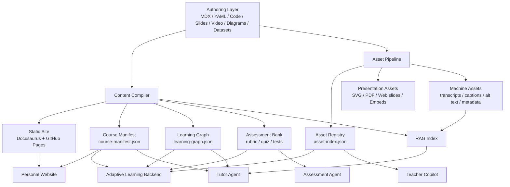

# AI-native Multimodal Curriculum Platform Design

Date: 2026-06-21

## 1. Product Intent

This project is not a single electronic book. It is an AI-native curriculum platform for teaching large language models, RAG, agents, evaluation, and deployment. The first public surface can be a polished GitHub Pages site, but the durable product asset is a structured, multimodal curriculum knowledge base.

The platform must serve three audiences from one source of truth:

- Developer-students who need concepts, code experiments, projects, and feedback.
- Teachers who need lesson plans, classroom activities, slides, rubrics, and reusable assets.
- Future teaching agents that need structured, cited, versioned knowledge.

The core architecture is:

```text
Multimodal curriculum source files
-> content and asset compilation
-> static learning site
-> machine-readable knowledge packages
-> RAG, agent, and adaptive learning systems
```

## 2. Design Principles

1. GitHub Pages is a presentation layer, not the system boundary.
2. MDX is the human authoring format; JSON and JSONL are the machine consumption formats.
3. Multimedia files are first-class teaching assets, not attachments.
4. Every unit should expose learning objectives, prerequisites, assessment criteria, and source citations.
5. Agents must access content through explicit manifests, asset indexes, learning graphs, and retrieval tools.
6. The first version should avoid login, databases, and CMS complexity until the content model stabilizes.
7. Large media should live outside the Git repository unless there is a strong reason to version it directly.
8. Content quality checks must be part of the build pipeline, not a manual afterthought.

## 3. Target Architecture



## 4. System Layers

### 4.1 Content Source Layer

The content source layer contains course files, module files, unit files, student lessons, teacher guides, labs, projects, quizzes, and rubrics. It should be understandable in Git without requiring a CMS.

Primary formats:

- `course.yaml` for course metadata.
- `unit.yaml` for unit metadata and learning contracts.
- `lesson.mdx` for student-facing reading.
- `teaching-guide.mdx` for teacher-facing delivery notes.
- `lab-python.md` and `lab-js.md` for code labs.
- `project.md` for applied tasks.
- `quiz.yaml` and `rubric.yaml` for assessment.
- `assets.yaml` for unit-level asset references.

### 4.2 Multimodal Asset Layer

The platform must support diverse learning assets:

- Text: MDX, Markdown, PDF, DOCX.
- Code: Python, JavaScript, TypeScript, notebooks, SQL, shell scripts.
- Math: LaTeX through KaTeX or MathJax.
- Diagrams: Mermaid, SVG, Excalidraw exports, Figma exports, PNG.
- Video: external video embeds, MP4 where appropriate, VTT or SRT captions.
- Audio: MP3, narrated explanations, classroom recordings.
- Slides: PPTX, PDF, Reveal.js, Marp.
- Data: CSV, JSON, JSONL, SQLite, small sample datasets.
- Interactive components: React demos, simulators, visualizers.
- Prompts and agent configs: Markdown or YAML.
- Assessments: quizzes, rubrics, test cases, expected outputs.

Each asset has three forms when possible:

```text
source: original authoring file
presentation: web-displayable version
machine: searchable and agent-readable representation
```

Examples:

- Video source is a URL or MP4, presentation is an embedded player, machine form is `transcript.vtt`, `chapters.json`, and `summary.md`.
- Slide source is `pptx`, presentation is `pdf` or web slides, machine form is `outline.md` and `slide-index.json`.
- Diagram source is Mermaid, Excalidraw, or Figma, presentation is SVG or PNG, machine form is alt text, caption, and graph metadata.
- Notebook source is `ipynb`, presentation is a rendered lesson page, machine form is extracted code cells, dependencies, and explanations.

### 4.3 Build And Validation Layer

The build layer converts authoring files into static pages and machine-readable artifacts. It also enforces content quality.

Required build outputs:

- `course-manifest.json`
- `asset-index.json`
- `rag-chunks.jsonl`
- `learning-graph.json`
- `assessment-bank.json`

Required validation:

- Frontmatter and YAML schema validation.
- Broken link detection.
- Missing alt text detection.
- Missing media captions or transcripts detection.
- Missing license/source metadata detection.
- Mermaid and math rendering checks.
- Code snippet linting and selected executable smoke tests.
- RAG chunk citation and source ID validation.

### 4.4 Static Experience Layer

The first public product should be a refined static site. Docusaurus with MDX is the recommended starting point because it supports structured documentation, MDX components, versioning, sidebars, syntax highlighting, and a practical GitHub Pages deployment path.

The site should expose:

- Learning paths for LLMs, RAG, agents, evaluation, and deployment.
- Unit pages with student mode and teacher mode.
- Labs and projects with Python and JavaScript tracks.
- Asset library for diagrams, prompts, slides, notebooks, datasets, and rubrics.
- Search and navigation.
- Versioned course releases.

### 4.5 Machine Knowledge Layer

The machine knowledge layer is what makes the platform agent-ready.

Core artifacts:

```text
course-manifest.json
  Course, module, unit, objectives, prerequisites, tags, difficulty, and audience.

asset-index.json
  Registered assets, formats, locations, licenses, display rules, and extraction rules.

rag-chunks.jsonl
  Retrieval chunks with stable source IDs, citations, audience, difficulty, and unit links.

learning-graph.json
  Knowledge dependencies and progression relationships.

assessment-bank.json
  Quizzes, rubrics, project criteria, test cases, and expected outcomes.
```

Agents and future applications must consume these artifacts instead of scanning arbitrary folders.

## 5. Repository Structure

```text
aidigitaltextbook/
  site/
    src/
      components/
      theme/
    docusaurus.config.ts

  curriculum/
    ai-engineering/
      course.yaml
      modules/
        01-llm-foundations/
          unit.yaml
          lesson.mdx
          teaching-guide.mdx
          lab-python.md
          lab-js.md
          project.md
          rubric.yaml
          quiz.yaml
          assets.yaml
          assets/

        02-rag/
        03-agent/
        04-evaluation/
        05-deployment/

  assets/
    diagrams/
    images/
    videos/
    audio/
    slides/
    notebooks/
    datasets/
    prompts/
    interactive/

  scripts/
    build-course-manifest.ts
    build-asset-index.ts
    build-rag-chunks.ts
    build-learning-graph.ts
    validate-content.ts
    validate-assets.ts

  generated/
    course-manifest.json
    asset-index.json
    rag-chunks.jsonl
    learning-graph.json
    assessment-bank.json

  docs/
    architecture/
    superpowers/
      specs/
```

## 6. Content Contracts

### 6.1 Unit Metadata

```yaml
id: rag-retrieval-pipeline
title: RAG Retrieval Pipeline
module: 02-rag
audience:
  - teacher
  - developer-student
level: intermediate
prerequisites:
  - embeddings
  - vector-search
learning_objectives:
  - Explain retrieval, reranking, context assembly, and generation.
  - Build a minimal RAG prototype in Python.
  - Evaluate citation quality and hallucination risk.
agent_use:
  retrievable: true
  chunk_strategy: concept-task-rubric
  recommended_tools:
    - retrieve_content
    - generate_quiz
    - grade_project
```

### 6.2 Asset Metadata

```yaml
id: rag-vector-search-diagram
type: diagram
format: svg
title: RAG Vector Search Flow
used_by:
  - unit: rag-retrieval-pipeline
    role: concept-visual
pedagogical_role: mental-model
license: original
source: assets/diagrams/rag-vector-search.svg
presentation:
  embed: true
  downloadable: true
machine:
  rag_index:
    include: true
    extraction: alt_text_plus_caption
  alt_text: Shows a user query transformed into an embedding, matched against a vector index, assembled into context, and passed to a model for grounded generation.
```

### 6.3 RAG Chunk Contract

```json
{
  "chunk_id": "rag-retrieval-pipeline:concept:retrieval-step",
  "source_id": "curriculum/ai-engineering/modules/02-rag/rag-retrieval-pipeline/lesson.mdx",
  "unit_id": "rag-retrieval-pipeline",
  "audience": ["developer-student", "teacher"],
  "difficulty": "intermediate",
  "content_type": "concept",
  "text": "Retrieval is the step that selects relevant external context before generation...",
  "citations": [
    {
      "label": "RAG Retrieval Pipeline",
      "path": "/ai-engineering/rag/rag-retrieval-pipeline"
    }
  ]
}
```

## 7. Agent Architecture

The platform should not use one general-purpose chatbot for all work. It should expose bounded agents with explicit tool access.

### Tutor Agent

Student-facing. Explains concepts, answers questions, generates practice, and recommends next steps. It should cite course sources and prefer hints over direct answers for project work.

### Teacher Copilot

Teacher-facing. Generates lesson plans, classroom activities, slide outlines, discussion prompts, board plans, and differentiated teaching suggestions. Human review is required before classroom use.

### Assessment Agent

Evaluation-facing. Grades submissions against rubrics, highlights evidence, identifies weak concepts, and suggests remediation. It should never invent grading criteria outside the rubric.

### Curriculum Agent

Curriculum-facing. Checks coverage, prerequisite integrity, missing assessments, stale assets, and version drift.

### Tool Boundary

Agents use explicit tools:

```text
get_course()
get_unit(unit_id)
retrieve_content(query, filters)
get_assets(unit_id, asset_type)
get_prerequisites(unit_id)
recommend_next(learner_state)
generate_lesson_plan(unit_id, duration)
grade_submission(rubric_id, submission)
```

## 8. Integration Strategy

### Personal Website

The personal website can consume the static site as a linked property at first. Later it can consume `course-manifest.json` and selected generated artifacts directly to render course cards, learning paths, and featured projects.

### Adaptive Teaching And Learning System

The adaptive system should consume:

- `course-manifest.json` for available content.
- `learning-graph.json` for prerequisites and next-step recommendations.
- `assessment-bank.json` for diagnostic and summative evaluation.
- `rag-chunks.jsonl` for grounded tutoring.
- `asset-index.json` for teacher and student resources.

### CMS

A CMS should not be introduced in the first version. The content schema should stabilize in Git first. A future CMS can be added as an authoring layer that writes the same source contracts.

## 9. Delivery Phases

### Phase 1: Static Excellence

Create a polished Docusaurus and MDX site deployable to GitHub Pages. Add the first course skeleton for LLMs, RAG, agents, evaluation, and deployment.

### Phase 2: Structured Intelligence

Add TypeScript generators for course manifest, asset index, RAG chunks, learning graph, and assessment bank. Add validation checks.

### Phase 3: Agent-ready Knowledge Base

Expose generated artifacts to a retrieval pipeline and implement read-only Tutor Agent and Teacher Copilot prototypes.

### Phase 4: Adaptive Learning

Add learner profiles, progress state, diagnostic assessments, remediation recommendations, and personalized paths.

### Phase 5: Platformization

Support multiple courses, multiple authors, versioned releases, external media storage, optional CMS integration, and API access for the personal website.

## 10. Risks And Mitigations

| Risk | Mitigation |
| --- | --- |
| Content becomes a pile of pages | Enforce unit metadata, assets metadata, and generated manifests from the start. |
| Media files bloat the repository | Keep large media in external storage or CDN; store only references, captions, and metadata. |
| Agent answers become ungrounded | Require source IDs, citations, retrieval filters, and tool-bound access. |
| Teachers cannot reuse student content | Maintain explicit `lesson.mdx`, `teaching-guide.mdx`, assets, activities, and rubrics per unit. |
| Early CMS slows progress | Use Git-based authoring until schemas and workflows stabilize. |
| Validation becomes optional | Make validation part of CI before deploy. |

## 11. First Release Success Criteria

The first release is successful when:

1. The site can be built and deployed as a polished static learning experience.
2. At least one complete module has student lesson, teacher guide, code lab, project, assets, quiz, and rubric.
3. The repository generates `course-manifest.json`, `asset-index.json`, and initial `rag-chunks.jsonl`.
4. Build validation catches missing required metadata, broken links, and missing asset descriptions.
5. The generated artifacts are clean enough for a future Tutor Agent to answer with citations.

